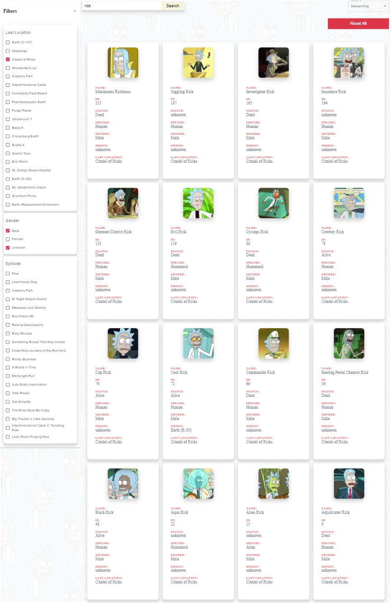
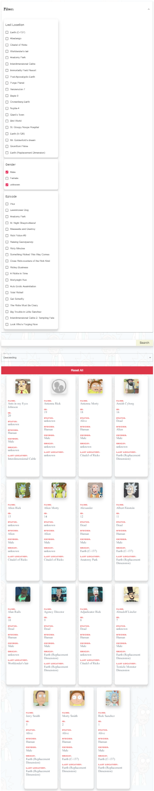

# Rick and Morty Characters

The POC consists of following features-

1.	Displays first 20 characters if no filter is applied
2.	3 filter categories – Last Location of character, Gender of Character and the Episodes the character has been part of
3.	Search for character with their name
4.	Sort the character results based on the character id in ascending or descending order
5.	**Feature 2, 3, 4 can be used together or independently based on need**
6.	**Responsive Style and structure : 4 character cards in 1 column for desktop, IpadPro Landscape, IphoneX Landscape and  2 character cards in 1 column for IphoneX Portrait, IpadPro Portrait**

Instructions available in `Readme` inside the folder

# Screenshots

### `Desktop`

### `Ipad Pro_Portrait`

### `Iphone X`

Same as `Ipad Pro_Portrait`
